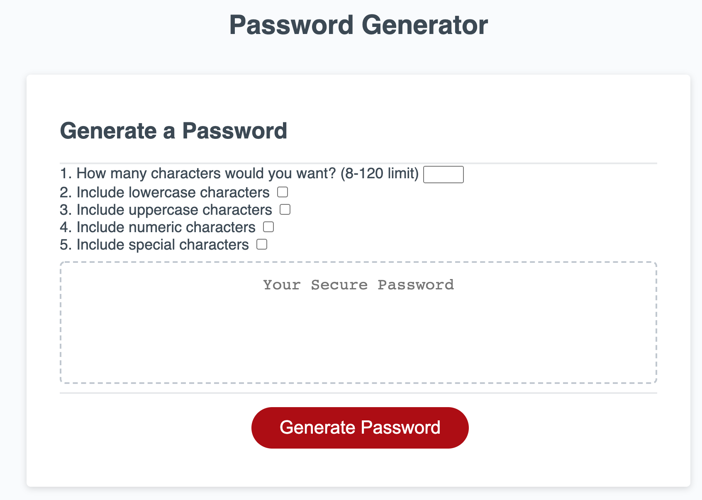

# Saul's Password Generator 2.0

## Purpose
Revamped password generator that is more interactive in which a user is able to select the criteria of interest that is used to create a password. A password is randomly generated and can have min and max length as well as different character types such as lowercase, upper case, numeric, and/or special characters.

## Built with
* HTML
* CSS
* JS

## Link to webpage
https://saul10huerta.github.io/passwordgenerator2/

### Contribution
Made by Saul Huerta